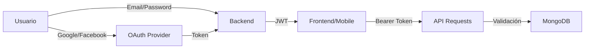

# 📚 Recipe Book Ecosystem

Ecosistema completo de aplicación de recetas con **Backend, Web App y Mobile App**, implementando autenticación híbrida, monetización dual (Stripe + IAP) y sistema de paywall para contenido premium.

---

## 🎯 Descripción General

**Recipe Book Ecosystem** es una plataforma cross-platform para gestión y visualización de recetas de cocina, con sistema de suscripción premium que desbloquea contenido exclusivo. El proyecto implementa las mejores prácticas de seguridad (OWASP Top 10), arquitectura escalable y código production-ready.

### Características Principales

✅ **Autenticación Híbrida**
- Login local (email/password)
- OAuth 2.0 (Google, Facebook)
- Identity Merging automático
- Gestión de sesiones con JWT

✅ **Sistema de Suscripciones**
- Free tier con recetas básicas
- Premium tier con contenido exclusivo
- Paywall implementado en todas las plataformas
- Base de datos como Source of Truth

✅ **Monetización Dual**
- **Web**: Stripe Checkout + Webhooks
- **Mobile**: In-App Purchases (iOS/Android)
- Validación centralizada en backend

✅ **RBAC (Role-Based Access Control)**
- Roles: User / Admin
- Permisos granulares
- Middleware de autorización

---

## 🛠️ Stack Tecnológico

### Backend
```
Node.js v18+
├── Express.js          # Framework web
├── MongoDB + Mongoose  # Base de datos NoSQL
├── Passport.js         # Autenticación (Local, Google, Facebook)
├── JWT                 # Tokens de sesión
├── Bcrypt              # Hash de contraseñas
├── Helmet + CORS       # Seguridad
└── Jest + Supertest    # Testing
```

### Frontend Web
```
React 18
├── Vite                # Build tool
├── Tailwind CSS        # Utility-first CSS framework
├── React Router        # Navegación
├── Context API         # State management
├── Vanilla CSS         # Estilos custom (compatible con Tailwind)
└── Fetch API           # HTTP requests
```

### Mobile App
```
React Native
├── Expo SDK ~53        # Framework
├── Expo Linking        # Deep linking (OAuth)
├── Expo IAP            # In-App Purchases
├── AsyncStorage        # Persistencia local
└── React Navigation    # (implícito)
```

### DevOps & Deployment
```
Git + GitHub            # Control de versiones
Vercel                  # Hosting (Backend + Frontend)
MongoDB Atlas           # Base de datos cloud (M0 Free)
Stripe                  # Pagos web
Apple/Google IAP        # Pagos mobile
```

---

## 📁 Estructura del Proyecto

```
App_libro/
├── backend/                    # Node.js + Express + MongoDB
│   ├── src/
│   │   ├── config/
│   │   │   ├── db.js          # Conexión MongoDB
│   │   │   └── passport.js    # Estrategias OAuth
│   │   ├── controllers/
│   │   │   ├── authController.js
│   │   │   └── paymentController.js
│   │   ├── middleware/
│   │   │   └── authMiddleware.js  # JWT, Admin, Paywall
│   │   ├── models/
│   │   │   ├── User.js        # Schema con RBAC
│   │   │   └── Recipe.js      # Schema con isPremium
│   │   ├── routes/
│   │   │   ├── authRoutes.js
│   │   │   └── paymentRoutes.js
│   │   └── app.js             # Express app
│   ├── tests/
│   │   ├── auth.test.js       # Tests en español
│   │   └── payment.test.js
│   ├── server.js              # Entry point
│   ├── vercel.json            # Config Vercel
│   └── package.json
│
├── frontend/                   # React + Vite
│   ├── src/
│   │   ├── components/
│   │   │   ├── Login.jsx      # Login + Social
│   │   │   ├── Dashboard.jsx  # Main view
│   │   │   ├── RecipeCard.jsx # Card con lock
│   │   │   └── PremiumBanner.jsx
│   │   ├── context/
│   │   │   └── AuthContext.jsx  # JWT + State
│   │   ├── App.jsx
│   │   ├── main.jsx
│   │   └── index.css          # Design system
│   ├── vercel.json
│   └── package.json
│
├── mobile/                     # React Native + Expo
│   ├── context/
│   │   └── AuthContext.js     # Deep linking
│   ├── screens/
│   │   ├── LoginScreen.js
│   │   └── DashboardScreen.js # IAP flow
│   ├── App.js
│   ├── app.json               # Expo config + scheme
│   └── package.json
│
├── README.md                   # Este archivo
├── DEPLOYMENT.md               # Guía de deployment
└── QUICKSTART_DEPLOYMENT.md    # Quick start
```

---

## 🎨 Arquitectura

### Flujo de Autenticación



### Flujo de Monetización

**Web (Stripe)**
```
Usuario → Stripe Checkout → Pago exitoso → Webhook Backend → Update MongoDB → Premium Access
```

**Mobile (IAP)**
```
Usuario → Native IAP → Receipt → Backend Validation → Update MongoDB → Premium Access
```

### Database Schema

**User**
```javascript
{
  email: String (unique),
  password: String (hashed),
  authProvider: 'local' | 'google' | 'facebook' | 'apple',
  providerId: String,
  role: 'user' | 'admin',
  subscriptionStatus: 'free' | 'premium',
  subscriptionExpiry: Date
}
```

**Recipe**
```javascript
{
  title: String,
  ingredients: [String],
  instructions: String,
  images: [String],
  isPremium: Boolean,
  createdBy: ObjectId (ref: User)
}
```

---

## 🔐 Seguridad

✅ Passwords hasheados con **bcrypt** (salt rounds: 10)  
✅ JWT con expiración de **30 días**  
✅ **Helmet.js** para headers HTTP seguros  
✅ **CORS** configurado para orígenes específicos  
✅ Passwords nunca retornados en API (`select: false`)  
✅ Validación de **Stripe webhook signatures**  
✅ Validación de **IAP receipts** con Apple/Google  
✅ Environment variables para secretos  
✅ Network Access restringido en MongoDB Atlas  

---

## 🚀 Quick Start

### Requisitos Previos
- Node.js 18+
- npm o yarn
- MongoDB local o Atlas
- (Opcional) Expo CLI para mobile

### Backend
```bash
cd backend
npm install
cp .env.example .env  # Configurar variables
npm run dev           # http://localhost:5000
```

### Frontend Web
```bash
cd frontend
npm install
npm run dev           # http://localhost:5173
```

### Mobile (Expo)
```bash
cd mobile
npm install
npx expo start        # Escanear QR con Expo Go
```

---

## 🌐 Deployment en Producción

### MongoDB Atlas (Free Tier)
1. Crear cluster en https://mongodb.com/cloud/atlas
2. Configurar usuario y network access
3. Copiar connection string

### Vercel (Backend + Frontend)
```bash
npm install -g vercel
cd backend && vercel --prod
cd frontend && vercel --prod
```

Ver **[DEPLOYMENT.md](./DEPLOYMENT.md)** para guía completa paso a paso.

---

## 📝 Variables de Entorno

### Backend
```env
MONGO_URI=mongodb+srv://...
JWT_SECRET=your_secret_key
NODE_ENV=production
FRONTEND_URL=https://your-frontend.vercel.app

# OAuth (opcional)
GOOGLE_CLIENT_ID=...
GOOGLE_CLIENT_SECRET=...
FACEBOOK_APP_ID=...
FACEBOOK_APP_SECRET=...

# Stripe
STRIPE_SECRET_KEY=sk_...
STRIPE_WEBHOOK_SECRET=whsec_...
```

### Frontend
```env
VITE_API_URL=https://your-backend.vercel.app
```

---

## 🧪 Testing

### Backend
```bash
cd backend
npm test  # Ejecuta Jest con tests en español
```

**Cobertura:**
- ✅ Autenticación local
- ✅ Registro de usuarios
- ✅ Login con credenciales
- ✅ Validación IAP (mocked)
- ✅ Webhooks Stripe (mocked)
- ✅ Control de acceso (Paywall)

---

## 🎨 Diseño UI/UX

### Paleta de Colores
```css
Primary:   hsl(260, 85%, 58%)  /* Purple */
Secondary: hsl(340, 82%, 52%)  /* Pink */
Accent:    hsl(180, 80%, 45%)  /* Cyan */
Background: hsl(230, 17%, 14%) /* Dark */
```

### Características de Diseño
- 🌙 **Dark Mode** por defecto
- ✨ **Animaciones suaves** en hover/transitions
- 🎯 **Glassmorphism** y gradientes modernos
- 📱 **Responsive** mobile-first
- 🔒 **Lock overlays** para contenido premium
- 💎 **Premium badges** visuales

---

## 📦 Características Implementadas

### MVP Completo
- [x] Autenticación local (email/password)
- [x] OAuth Google
- [x] OAuth Facebook
- [x] Identity Merging
- [x] RBAC (User/Admin)
- [x] Paywall en recetas
- [x] Stripe Checkout (Web)
- [x] IAP validation (Mobile)
- [x] JWT sessions
- [x] Dashboard con recetas
- [x] Premium banner
- [x] Lock overlays
- [x] Tests automatizados

### Configurado para Producción
- [x] Vercel deployment ready
- [x] MongoDB Atlas compatible
- [x] Environment variables
- [x] CORS configurado
- [x] OAuth callbacks dinámicos
- [x] Error handling
- [x] Loading states
- [x] Responsive design

---

## 📚 Documentación Adicional

- **[DEPLOYMENT.md](./DEPLOYMENT.md)** - Guía completa de deployment
- **[QUICKSTART_DEPLOYMENT.md](./QUICKSTART_DEPLOYMENT.md)** - Pasos rápidos
- **[implementation_plan.md](./implementation_plan.md)** - Plan técnico detallado (artifacts)
- **[walkthrough.md](./walkthrough.md)** - Documentación completa del proyecto (artifacts)

---

## 🔮 Próximas Mejoras

### Features
- [ ] Búsqueda y filtros de recetas
- [ ] Favoritos de usuario
- [ ] Comentarios y ratings
- [ ] Upload de imágenes (Cloudinary)
- [ ] Recetas creadas por usuarios
- [ ] Panel de administración
- [ ] Analytics dashboard

### Technical
- [ ] Redis para caching
- [ ] GraphQL API
- [ ] WebSockets (real-time)
- [ ] PWA (Progressive Web App)
- [ ] CI/CD con GitHub Actions
- [ ] Monitoring (Sentry)
- [ ] E2E tests (Cypress)

---

## 👨‍💻 Desarrollador

Proyecto desarrollado siguiendo estándares de producción:
- ✅ Código limpio y comentado **en español**
- ✅ Arquitectura escalable
- ✅ Seguridad OWASP Top 10
- ✅ Tests automatizados
- ✅ Documentación completa

---

## 📄 Licencia

Este proyecto es de código abierto para fines educativos.

---

## 🆘 Soporte

Para problemas o preguntas:
1. Revisar **[DEPLOYMENT.md](./DEPLOYMENT.md)** - Troubleshooting section
2. Verificar environment variables
3. Revisar logs: `vercel logs`
4. Verificar MongoDB Atlas network access

---

## 🎯 Tech Stack Summary

| Layer | Technology | Purpose |
|-------|-----------|---------|
| **Backend** | Node.js + Express | API REST |
| **Database** | MongoDB + Mongoose | NoSQL Database |
| **Auth** | Passport.js + JWT | Hybrid Authentication |
| **Frontend** | React + Vite | Web Application |
| **Mobile** | React Native + Expo | iOS/Android App |
| **Payments** | Stripe + IAP | Monetization |
| **Hosting** | Vercel | Serverless Deployment |
| **DB Cloud** | MongoDB Atlas | Database Hosting |

---

**⭐ Proyecto Production-Ready para Portfolio**

Desarrollado con arquitectura profesional, seguridad robusta y código limpio. Listo para demostrar habilidades full-stack en entrevistas técnicas.
